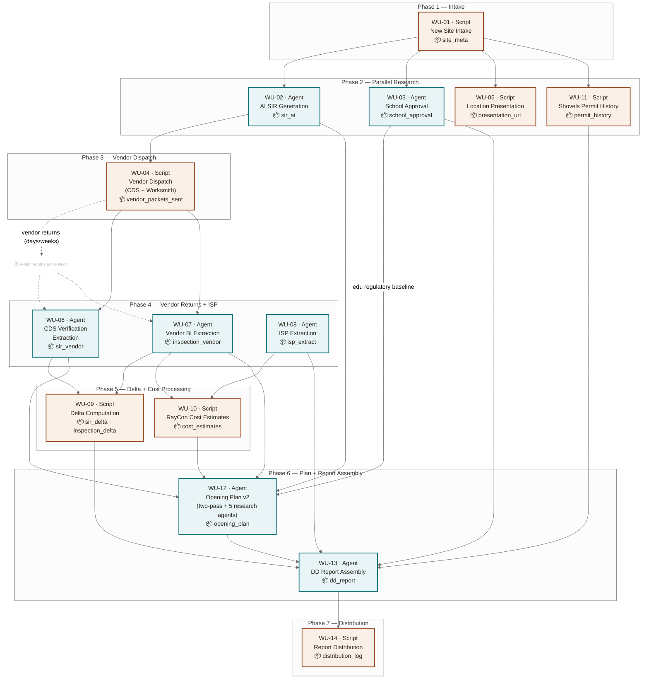

# DD Pipeline — Process Flow

> Interactive version: [process-flow.html](process-flow.html) (open locally or via GitHub Pages)

## Legend

| Color | Type | Examples |
|---|---|---|
| Teal border | Agent (LLM) | WU-02 AI SIR, WU-03 School Approval, WU-12 Opening Plan v2 |
| Orange border | Script (Deterministic) | WU-01 Intake, WU-04 Vendor Dispatch, WU-10 RayCon |

## Key Dependency: School Approval → Opening Plan v2

WU-03 (School Approval) now feeds WU-12 (Opening Plan v2) directly. The school-approval output pre-populates 15 education regulatory fields (state archetype, approval type, gating status, calendar windows, etc.) so that Opening Plan v2's Research Agent 3 can deepen rather than rediscover the baseline.
